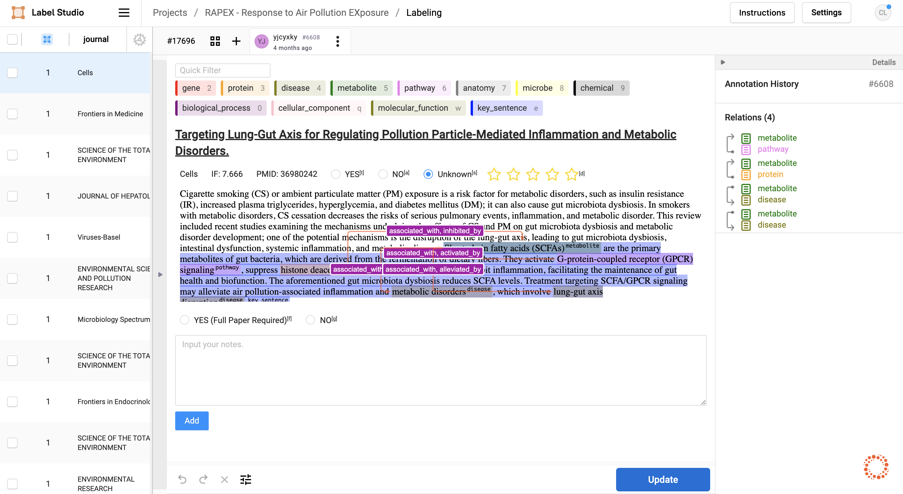

# Paper Downloader

There are so many papers on the internet and we need to extract findings from them. Sometimes we need to label the papers manually or automatically. For example, we use the label studio to label the papers manually.



Before labeling, we need to prepare the papers for the NLP pipeline or the labeling pipeline first. This project is used to prepare the metadata of papers, download the pdf files of papers and convert the pdf files to html files.

If you want to deploy the full pipeline, you can use the [prophet-studio](https://github.com/yjcyxky/prophet-studio) project. Which is composed of the [label-studio](https://github.com/yjcyxky/label-studio) and the [paper-downloader](https://github.com/yjcyxky/paper-downloader) project.

## Use `paper-downloader` as a command line tool
### Install the paper downloader

```
pip install git+https://github.com/yjcyxky/paper-downloader.git
```

### Prepare papers for the NLP pipeline
#### Fetch metadata

```
pdownloader fetch-metadata -d 3 -o metadata/file.json -c config/pmids_config.json
```

#### Fetch PDFs

```
pdownloader fetch-pdf -m metadata/file.json -o ./pdf
```

#### PDF to HTML

```
pdownloader pdf2html -p ./pdf -h ./html
```

## Build the docker image

```
git clone https://github.com/yjcyxky/paper-downloader.git

cd paper-downloader
bash build-docker.sh
```